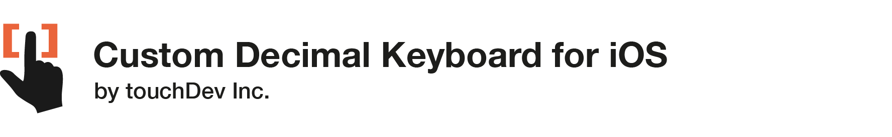

# TD-DecimalKeyboard

## About
*TD-DecimalKeyboard* is a custom decimal keyboard for iOS devices. The keyboard is highly customizeable and can be attached to any UITextField to replace the native iOS keyboard.

This project is maintained by **touchDev**. 
We specialize in the designing and coding custom UI for Mobile Apps. 

## Installation
Just add `TDDecimalKeyboard.h`, `TDDecimalKeyboard.m`, and image assets to your project.
